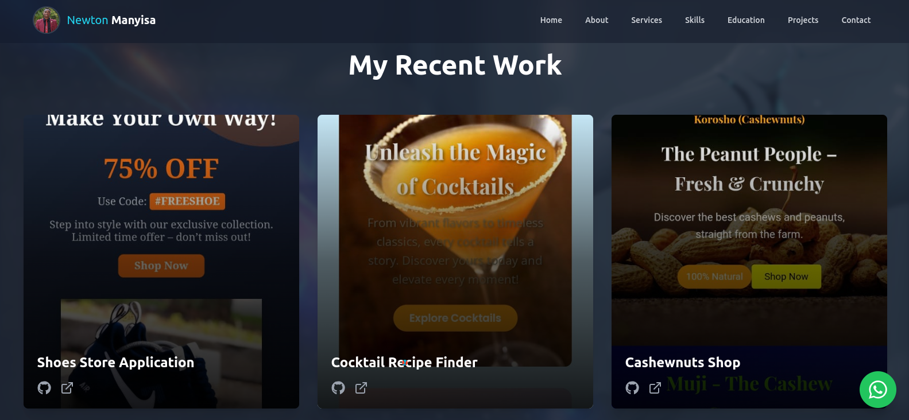

# Newton Manyisa - Full-Stack Developer Portfolio

A modern, animated, and fully responsive portfolio website built with React, Tailwind CSS, and Framer Motion to showcase my skills, projects, and professional journey.

**Live Demo:** [**https://your-live-url.com**](https://portfolio-1-zosc.onrender.com/)



---

## ✨ Features

This portfolio is designed to be a rich, interactive experience. Key features include:

- **Animated Hero Section:** A welcoming introduction with your photo and a clear call-to-action.
- **Professional "About Me" Section:** Features key statistics and dual "Let's Talk" / "Download CV" call-to-actions.
- **Dynamic Services Showcase:** Highlights your core competencies with clean, animated cards.
- **Unique Skills Section:** A dual-format display with a clean, three-column text list for scannability and a colorful, continuous marquee of technology icons for visual appeal.
- **Smart Education & Journey Timeline:** A space-efficient, two-column layout presenting formal education and practical experience.
- **Immersive Projects Section:** Full-bleed image cards with a subtle video background and "reveal on hover" details.
- **Functional Contact Form:** A clean, user-friendly form that sends emails directly to your inbox using Web3Forms, complete with beautiful `SweetAlert2` notifications for success and error states.
- **Comprehensive Footer:** Includes contact info, availability status, useful links, and a unique "Digital Craftsmanship" section with interactive tooltips.
- **Custom Cursor:** A unique, interactive cursor that provides a premium feel and changes state on hover and click.
- **Floating WhatsApp Button:** A persistent, easy-to-use button for immediate contact.
- **Responsive Design:** Fully responsive layout with an animated hamburger menu for seamless navigation on all devices.
- **Smooth Scrolling:** Implemented with `react-scroll` for elegant navigation between sections.

---

## 🛠️ Tech Stack & Tools

This project leverages a modern, efficient tech stack to deliver a high-performance, visually stunning experience.

- **Frontend:**

  - [**React**](https://reactjs.org/) (UI Library)
  - [**Vite**](https://vitejs.dev/) (Build Tool)
  - [**Tailwind CSS**](https://tailwindcss.com/) (CSS Framework)
  - [**Framer Motion**](https://www.framer.com/motion/) (Animation Library)
  - [**React Icons**](https://react-icons.github.io/react-icons/) (Icons)
  - [**React Scroll**](https://github.com/fisshy/react-scroll) (Smooth Scrolling)
  - [**React Fast Marquee**](https://www.react-fast-marquee.com/) (Skills Marquee)
  - [**SweetAlert2**](https://sweetalert2.github.io/) (Alerts for Contact Form)

- **Backend Services:**
  - [**Web3Forms**](https://web3forms.com/) (For handling the contact form submissions)

---

## 🚀 Getting Started

To get a local copy up and running, follow these simple steps.

### Prerequisites

You need to have [Node.js](https://nodejs.org/) (which includes `npm`) installed on your machine.

### Installation & Setup

1.  **Clone the repository:**

    ```bash
    git clone https://github.com/your-username/your-portfolio-repo.git
    ```

2.  **Navigate to the project directory:**

    ```bash
    cd your-portfolio-repo
    ```

3.  **Install NPM packages:**

    ```bash
    npm install
    ```

4.  **Configure the Contact Form:**

    - Open the `src/components/Contact.jsx` file.
    - Find the following line:
      ```javascript
      const accessKey = "YOUR_ACCESS_KEY_HERE";
      ```
    - Replace `'YOUR_ACCESS_KEY_HERE'` with your actual Access Key from [Web3Forms](https://web3forms.com).

5.  **Run the development server:**
    ```bash
    npm run dev
    ```
    The application will now be running on `http://localhost:5173` (or another available port).

### Building for Production

To create a static, optimized build of the application for deployment:

```bash
npm run build
```

#👤 Contact
###Newton Manyisa
Portfolio: [your-live-url.com](https://portfolio-1-zosc.onrender.com/)
LinkedIn: [linkedin.com/in/yourprofile ](https://www.linkedin.com/in/manyisa-newton-114781346/)
GitHub: [@yourprofile](https://github.com/manyisanewton)
