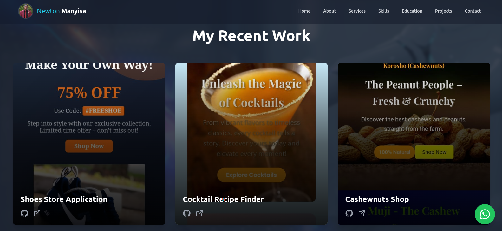

# Newton Manyisa — Full-Stack Developer Portfolio

Portfolio and production case studies for **Newton Manyisa**, a full-stack software developer based in Nairobi, Kenya.

**Live portfolio:** [newton-momanyi-manyisa.vercel.app](https://newton-momanyi-manyisa.vercel.app/)



## Expertise

- Frontend engineering with React, Next.js, TypeScript, Tailwind CSS, and Framer Motion
- Backend systems with Python, Flask, Node.js, C#, ASP.NET Core, and PostgreSQL
- ERPNext and Frappe Framework customization
- AI-assisted workflows with Ollama, Hugging Face, OCR, and document generation
- Business automation with n8n and Zoho
- Docker, Linux, CI/CD, cPanel, and cloud deployment
- Safaricom M-Pesa Daraja and other payment API integrations

## Selected case studies

- [AI-Powered Water Treatment Quotation Generator](https://newton-momanyi-manyisa.vercel.app/project/ai-powered-water-treatment-quotation-generator)
- [Vortexus Industrial Marketplace](https://newton-momanyi-manyisa.vercel.app/project/vortexus-industrial-marketplace)
- [Nelda Engineering Water Treatment Website](https://newton-momanyi-manyisa.vercel.app/project/nelda-engineering-water-treatment-website)
- [ERPNext Customization and Workflow Automation](https://newton-momanyi-manyisa.vercel.app/project/erpnext-customization-workflow-automation)
- [Norwa Africa Website](https://newton-momanyi-manyisa.vercel.app/project/norwa-africa-website)

## Technology

React 19, Vite, React Router, Tailwind CSS, Framer Motion, React Icons, Web3Forms, and Playwright.

## Local development

```bash
git clone git@github.com:manyisanewton/portfolio.git
cd portfolio
npm install
npm run dev
```

Create the production build with:

```bash
npm run build
```

The build also generates static metadata pages for every project case study, plus crawler discovery files for search and AI systems.

## Contact

- Email: [manyisanewton26@gmail.com](mailto:manyisanewton26@gmail.com)
- LinkedIn: [linkedin.com/in/newton-manyisa-b053733bb](https://www.linkedin.com/in/newton-manyisa-b053733bb/)
- GitHub: [github.com/manyisanewton](https://github.com/manyisanewton)
- Location: Nairobi, Kenya
